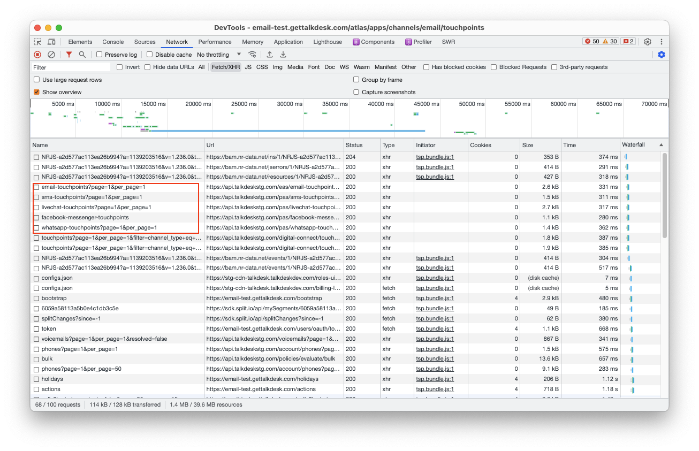

# Admin App 用户体验与性能优化方案

## 使用 SWR 优化 http 请求

## 添加 Node 中间层做接口聚合

由于 SWR 利用缓存 http 请求响应结果实现页面快速显示，但是客户端的请求数量并没有减少。所以推荐使用 express/koa/nest 等框架在客户端与服务端中间加一层 Node 中间层，用来做聚合聚合业务，减少客户端的请求数量

在根目录中添加 `server` 文件夹，存放 Node 中间层的代码

```shell
mkdir server
```

当前的目录组织如下图所示

```shell
.
├── package.json
├── public
├── server  #<--- 存放 Koa server
├── src
├── webpack
└── yarn.lock
```

初始化一个 koa 项目

```shell
cd server && yarn init
```

根据每一步的提示，填写项目相关信息

### Channels Touchpoint Total

Channels list 页面显示 Touchpoint 总数的时候会发起多个 http 请求



通过 Node 中间层将这些接口聚合成一个接口，减少客户端的请求数量

### Delete Fetch agentName/flowName RxJS Logic

以 SMS Channel 为例，SMS touchpoint 列表中的 agentName 和 flowName 依赖 `sms-touchpoints` 接口中响应结果，存在接口依赖的问题

当前项目中使用 `RxJS` 处理接口依赖问题，但是 `RxJS` 比较"重"，在当前的业务中使用量不大，可以通过 Node 中间层解决请求依赖的问题

## 添加 Service 层解耦业务逻辑与 UI

Admin App 页面不多，涉及的业务并不复杂，但是重复代码多，业务代码与 UI 耦合度高

`service` 层用来存放与业务状态相关的代码，与 `utils` 的区别是 `utils` 用来存放与任何状态无关的代码

下面举一个 Email Service 例子

```js
class EmailService {
  updateTouchpoint() {
    // patch sms touchpoint
  }

  getWindowUrl = async () => {
    const params = new URLSearchParams();
    const clientId = await getEnvByRegion("PROVIDER_CLIENT_ID");
    const redirectUrl = process.env.REACT_APP_REDIRECT_URL;
    const baseUrl = await getEnvByRegion("PROVIDER_URL");
    const scopes = ["email.read_only", "email.send"];
    params.append("client_id", clientId);
    params.append("redirect_uri", redirectUrl);
    params.append("response_type", "token");
    params.append("scopes", scopes.join(","));
    params.append("login_hint", email);

    return `${baseUrl}?${params.toString()}`;
  };
}

const emailService = new EmailService();

export default EmailService;
```

将 `patch/delete/post` 等接口抽到 Service，也可以将其他的业务方法抽到 Service 中。这样做，组件中只做两件事，显示数据和接收用户操作，用户操作绝大部分通过事件触发，事件的回调函数调用 `service.xxx()` 和 `setXXX()` 等方法
