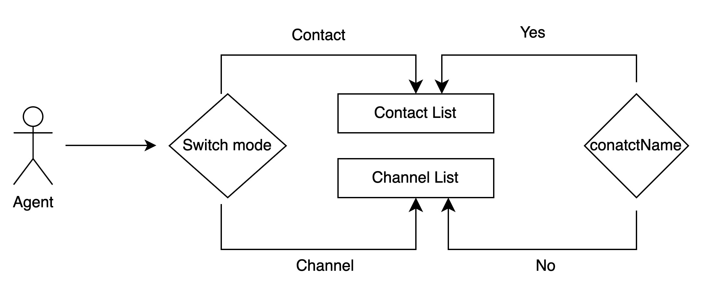

# Conv-App 支持 Channel 与 Contact 分组

由于客户需求，现在需要支持 conversations 以 Contact 分组

## 解决方案

根据有无 `contact name` 生成 contact list



根据架构图分析

`contact` 取自每个 channel 的 `command.context.contact` 字段

对于现在的 conversations 而言，conversation 有 contact name 也可以没有 contact name

当在 `metadata` 中加入 `contact` 字段后, `interactions` 状态值结果如下

```js
[
  {
    id: "e20de55fbc4e47aa833dc22bc4c505d4",
    active: true,
    title: {
      value: "+19892641733",
    },
    requires_attention: false,
    is_transfer: false,
    channel: "sms",
    created_at: 1690439288932,
    badge: 0,
    spanId: "9865e59a-55e8-4440-ab8b-2887976bdb68",
    timestamp: "2023-07-27T06:28:08.934Z",
    contact: "", // <--- 添加的字段
  },
];
```

`ongoingInteractionsPerChannel` 字段的结构如下

```js
({
  email: [{}],
  sms: [{}],
});
```

最终的 `interactionGroups` 数据结构是对象数组，其中只有三项

```js
const interactionGroups = [];
```

## UI 改动部分

- 添加 channel/contact 分组切换 icon
- 点开 contact 后，显示 sms/chat/email 等等 conversation

## 核心代码改动

`ui-protocol.ts` 中添加 `contact` field 校验规则

```ts
// libs/shared/core-api/src/schemas/base-schemas/ui-protocol.ts

export const UI_PROTOCOL_SCHEMA: JSONSchema7 = {
   //....,
   metadata: {
     type: 'object',
     properties: {
       //...,
      contact: {
        type: 'object',
        properties: {
          identifier: {
            type: 'string',
            description: 'Contact Unique ID'
          },
          name: {
            type: 'string',
            description: 'Contact Name'
          }
        },
        required: ['identifier', 'name']
      }
    }
   },
   ...
}
```

需要在 `command-processors` 中的 `metadata` 添加 `contact` 字段。下面以 `digital_connect_conversation` 为例

```js
// apps/channels/digital-connect/src/command_processors/digital.connect.conversation.js

export const digital_connect_conversation = async ({}) => {
  return {
    metadata: {
      //...
      contact: commandProcessosHelpers.getContact(command),
    },
  };
};
```

还要在 `libs/shared/digital-extension-points/src/command_processors/digital-connect/helpers.js` 添加 `getContact` 方法

```js
// libs/shared/digital-extension-points/src/command_processors/digital-connect/helpers.js

const getContact = (command) => {
  if (!command.context || !command.context.contact) return undefined;
  const participant = findParticipantByType(command, "contact_person");
  if (participant) {
    const contactValue = participant.via_resource?.value || "";
    const contactName = participant.name;
    const contactHref = participant.href;
    return {
      identifier: contactHref || contactValue,
      name: contactName || contactValue,
    };
  }
  return undefined;
};
```

接下来就是将 conversation 以 contact 分组的核心代码

```js
// this transform function return type is InteractionGroups
export const getInteractionGroups = (channelMap) => {
  const interactions = Object.keys(channelMap).reduce(
    (acc, channel) => acc.concat(channelMap[channel]),
    []
  );
  const { interactionsWithContact, interactionsWithOutContact, contacts } =
    splitInteractionsByContact(interactions);
  const voiceGroup = {
    type: "channel",
    identifier: "voice",
    data: (channelMap.voice || []).sort(compareInteractions),
  };
  const contactGroup = {
    type: "contact",
    identifier: "contact",
    data: contacts
      .sort((con1, con2) => con1.name.localeCompare(con2.name)) // Sort by name A-z
      .map((contact) => ({
        ...contact,
        data: interactionsWithContact
          .filter(
            (interaction) =>
              interaction.contact.identifier === contact.identifier
          )
          .sort(compareChannelAndInteractions), // Sort by channel and time
      })),
  };
  // If there is no contact this keeps the existing channel grouping
  const channelGroups = Object.keys(channelMap)
    .filter((channel) => channel !== "voice")
    .sort((ch1, ch2) => getDisplayPriority(ch1) - getDisplayPriority(ch2))
    .map((channel) => ({
      type: "channel",
      identifier: channel,
      data: interactionsWithOutContact
        .filter((interaction) => interaction.channel === channel)
        .sort(compareInteractions),
    }));

  return [voiceGroup, contactGroup, ...channelGroups];
};
```

然后在 ActiveTab 组件中将以 contact 分组数据

```js
const ActiveTab = () => {
  const [interactionGroups, setInteractionGroups] = useState([]);

  useEffect(() => {
    const unregister = api.onInteractionsChange(() => {
      setInteractionGroups(getInteractionGroups(ongoingInteractionsPerChannel));
    });
  }, []);
};
```
