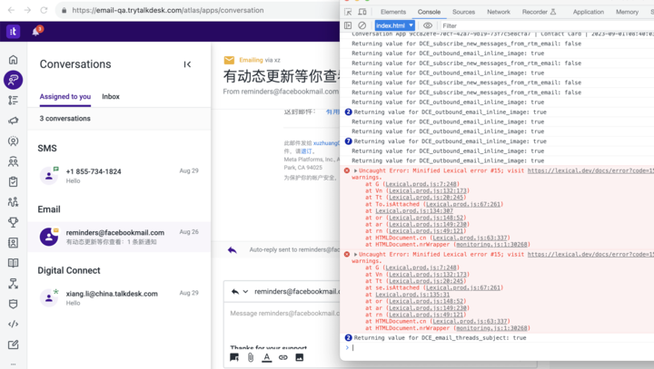

# @digital/talkdesk-editor 重复打包

## 问题描述

当 Assigned to you tab 里有 email + DG conversations 时，消息输入框无法输入



## 根本原因

因为 `@conversation-app/digital-extension-points` 中使用 `@digital/talkdesk-editor` 依赖，`email-channel` 也使用了 `@digital/talkdesk-editor`。
`digital-connect-channel` 使用了 `@conversation-app/digital-extension-points`，同时加载 email + DG conversations 会造成 `@digital/talkdesk-editor` 依赖
重复加载，产生无法输入的问题

## 解决思路

不管是 Host 还是 Remote, 都要对 `@digital/talkdesk-editor` 做单例模块限制

核心代码改动

Host module 的配置文件里需要添加下列代码

```js
// apps/runtime/module-federation.config.js
const { dependencies } = require("./package.json");

const moduleFederationConfig = {
  name: "runtime",
  shared: {
    "@digital/talkdesk-editor": { singleton: true },
  },
};

module.exports = moduleFederationConfig;
```

Remote module 的配置文件里也需要添加下列代码。以 DG 为例

```js
// apps/channels/digital-connect/module-federation.config.js
const { dependencies } = require("./package.json");

const moduleFederationConfig = {
  name: "digital_connect",
  library: { type: "var", name: "digital_connect" },
  filename: "remoteEntry.js",
  exposes: {
    "./Channel": "./src/remote-entry.js",
  },
  shared: {
    "@digital/talkdesk-editor": { singleton: true },
  },
};

module.exports = moduleFederationConfig;
```

对 Email/SMS/Chat/Whatsapp/FBM/DG fax 等同样处理
