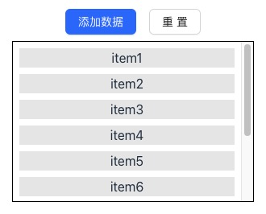

# 一种滚动到顶分页加载数据的解决方案

## 滚动条位置分析

下面是一个简单列表组件

```jsx
import { useState } from "react";
import { Button, Space } from "antd";

import styles from "./index.module.css";

const defaultNums = [0, 1, 2, 3, 4, 5, 6, 7, 8, 9];

const ScrollList = () => {
  const [nums, setNums] = useState(defaultNums);

  const handleClick = () => setNums((nums) => [nums.length, ...nums]);

  const reset = () => setNums(defaultNums);

  return (
    <Space direction="vertical">
      <Space>
        <Button
          onClick={handleClick}
          style={{ marginRight: "8px" }}
          type="primary"
        >
          添加数据
        </Button>
        <Button onClick={reset}>重置</Button>
      </Space>

      <div className={styles.wrapper}>
        <div>
          <ul>
            {nums.map((num) => (
              <li key={num} className={styles.li}>
                {`item${num + 1}`}
              </li>
            ))}
          </ul>
        </div>
      </div>
    </Space>
  );
};

export default ScrollList;
```

`ScrollList` 组件使用 `antd` 基础组件库，组件由添加数据和重置按钮和列表构成，显示效果如下



### 从数组尾部添加数据

现在对 `ScrollList` 组件做一点小改动，点击新增数据按钮，从数组尾部添加一些数据

```jsx
const new_nums = [10, 11, 12, 13, 14, 15, 16, 17, 18, 19];

const addNums = () => setNums((nums) => [...nums, new_nums]);
```

点击新增数据按钮，可以观察到数据添加到 `List` 尾部，但是滚动条位置没有发生变动

### 从数组头部添加数据

从数组头部添加一些数据

```jsx
const new_nums = [10, 11, 12, 13, 14, 15, 16, 17, 18, 19];

const addNums = () => setNums((nums) => [new_nums，...nums ]);
```

点击新增数据按钮，可以观察到数据添加到 `List` 头部，但是滚动条移动到容器顶部

## 往底部滚动分页加载数据
