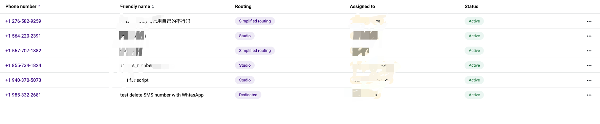
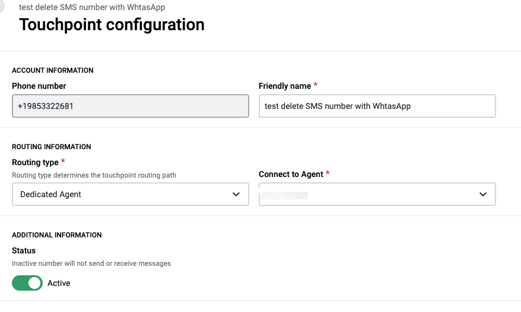
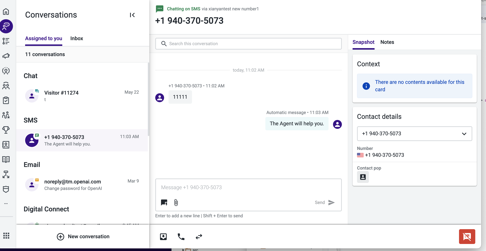
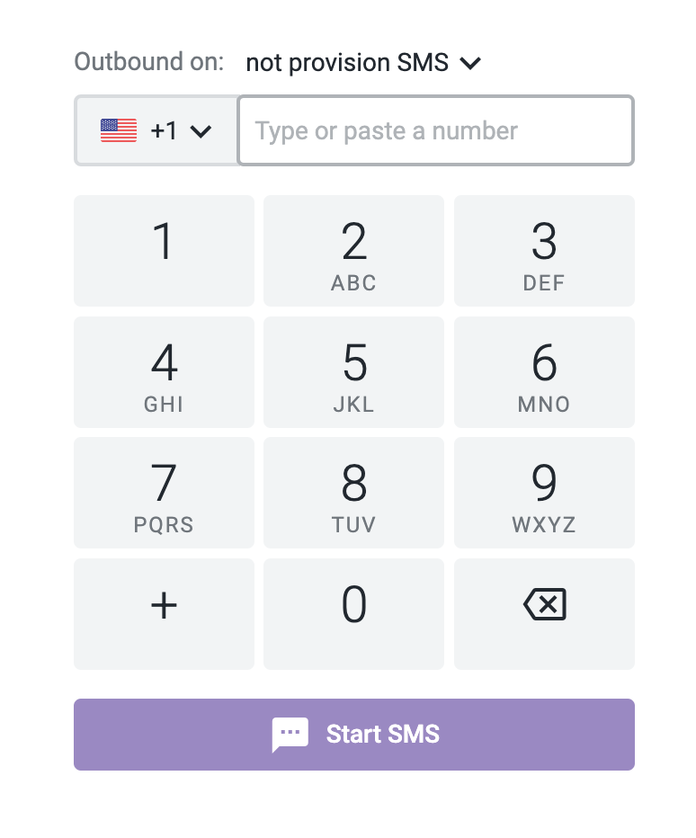

# 如何创建 SMS 会话

可以通过 email-qa 环境向 email-test 环境创建 SMS 会话。反之亦然

## 可用的 touchpoint

打开 email-test 环境的 Admin 产品，在 sms touchpoint 列表上找到可以用的 touchpoint

选择一个 sms touchpint, 点击打开详情配置

根据自己的需求选择合适的 Routing type。复制 Phone number，后面需要使用到

## 创建 SMS 会话

打开 email-qa 环境的 Conv-App 产品

点击 new conversation 按钮，选择创建 outbound sms

选择可用的 Outbound 号码，输入上一步复制的 phone number， 点击 Start SMS 按钮既可成功创建 sms 会话
